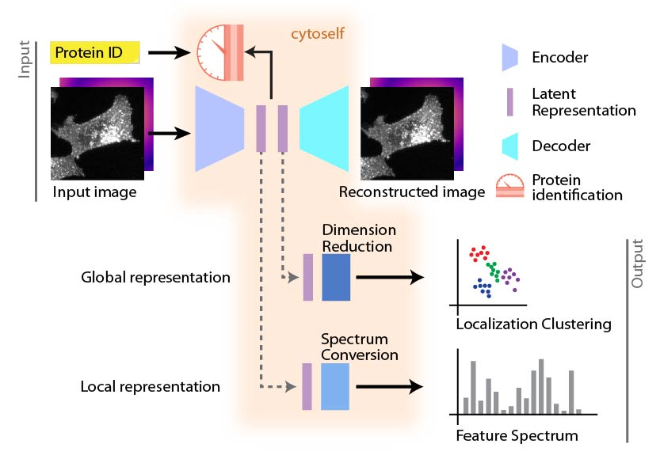

# cytoself

[](https://github.com/python/black)
[](https://pypi.org/project/cytoself)
[](https://python.org)
[](https://doi.org/10.1101/2021.03.29.437595)
[](https://opensource.org/licenses/BSD-3-Clause)


cytoself is a self-supervised platform that we developed for learning features of protein subcellular localization from microscopy images. 
This model is described in detail in our recent preprint [[2]](https://www.biorxiv.org/content/10.1101/2021.03.29.437595v1).
The representations derived from cytoself encapsulate highly specific features that can derive functional insights for 
proteins on the sole basis of their localization.

Applying cytoself to images of endogenously labeled proteins from the recently released 
[OpenCell](https://opencell.czbiohub.org) database creates a highly resolved protein localization atlas
[[1]](https://www.biorxiv.org/content/10.1101/2021.03.29.437450v1). 

[1] Cho, Nathan H., et al. "OpenCell: proteome-scale endogenous tagging enables the cartography of human cellular organization." bioRxiv (2021).
https://www.biorxiv.org/content/10.1101/2021.03.29.437595v1 <br />
[2] Kobayashi, Hirofumi, et al. "Self-Supervised Deep-Learning Encodes High-Resolution Features of Protein Subcellular Localization." bioRxiv (2021).
https://www.biorxiv.org/content/10.1101/2021.03.29.437595v1


## How cytoself works
cytoself uses images and its identity information as a label to learn the localization patterns of proteins.
We used cell images where single protein is labeled and the ID of labeled protein as 
identity information.




## What's in this repository
This repository offers three main components: 
[`DataManager`](https://github.com/royerlab/cytoself/blob/df0e421aa291879275582c51119cbd0319b2a004/cytoself/data_loader/data_manager.py#L6), 
[`cytoself.models`](https://github.com/royerlab/cytoself/tree/main/cytoself/models), 
and 
[`Analytics`](https://github.com/royerlab/cytoself/blob/df0e421aa291879275582c51119cbd0319b2a004/cytoself/analysis/analytics.py#L18).

[`DataManager`](https://github.com/royerlab/cytoself/blob/df0e421aa291879275582c51119cbd0319b2a004/cytoself/data_loader/data_manager.py#L6) 
is a simple module to handle train, validate and test data. 
You may want to modify it to adapt to your own data structure.
This module is in 
[`cytoself.data_loader.data_manager`](https://github.com/royerlab/cytoself/blob/main/cytoself/data_loader/data_manager.py).

[`cytoself.models` ](https://github.com/royerlab/cytoself/tree/main/cytoself/models)
contains modules for three different variants of the cytoself model: 
a model without split-quantization, a model without the pretext task, and the 'full' model (refer to our preprint for details about these variants). 
There is a submodule for each model variant that provides methods for constructing, compiling, and training the models (which are built using tensorflow).

`Analytics` is a simple module to perform analytic processes such as dimension reduction and plotting. 
You may want to modify it too to perform your own analysis. This module is in 
[`cytoself.analysis.analytics`](https://github.com/royerlab/cytoself/blob/main/cytoself/analysis/analytics.py). 
[](https://colab.research.google.com/github/royerlab/cytoself/blob/main/examples/simple_example.ipynb)


## Installation
Recommended: create a new environment and install cytoself on the environment from pypi
```shell script
conda create -y -n cytoself python=3.7
conda activate cytoself
pip install cytoself
```

### (Option) Install TensorFlow GPU
If your computer is equipped with GPUs that support Tensorflow 1.15, you can install Tensorflow-gpu to utilize GPUs.
Install the following packages before cytoself, or uninstall the existing CPU versions and reinstall the GPU versions 
again with conda.
```shell script
conda install -y h5py=2.10.0 tensorflow-gpu=1.15
```

### For the developers

You can also install cytoself from this GitHub repository.

```shell script
git clone https://github.com/royerlab/cytoself.git
pip install .
```

### Troubleshooting

In case of getting errors in the installation, run the following code inside the cytoself folder to manually install 
the dependencies.

```shell
pip install -r requirements.txt
```

As a reference for a complete dependency, a snapshot of a working environment can be found in 
[`environment.yml`](https://github.com/royerlab/cytoself/blob/main/environment.yml)


## Example script
A minimal example script is in 
[`example/simple_training.py`](https://github.com/royerlab/cytoself/blob/main/examples/simple_example.py).

Test if this package runs in your computer with command 
```shell script
python examples/simple_example.py
```


## Computation resources
It is highly recommended to use GPU to run cytoself. 
A full model with image shape (100, 100, 2) and batch size 64 can take ~9GB of GPU memory.


## Tested Environment
Google Colab (CPU/GPU/TPU)

macOS 10.14.6, RAM 32GB (CPU)

Windows10 Pro 64bit, RTX 1080Ti, CUDA 11.6 (CPU/GPU)

Ubuntu 18.04.6 LTS, RTX 2080Ti, CUDA 11.2 (CPU/GPU)


